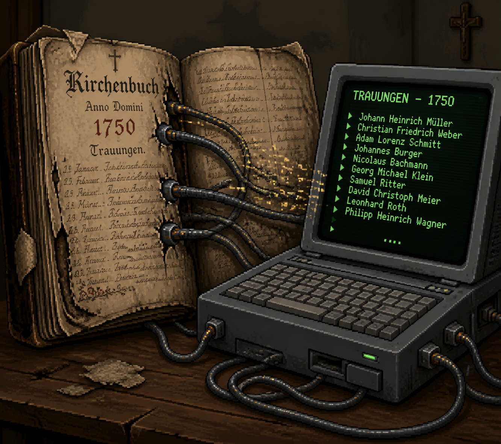

## Projekt Trauindex Sachsen
### Zur Online-Suche:
https://tintenfrass.github.io/simplechurchbookindexes/

### Beschreibung

In diesem Projekt geht es um die Erstellung eines Schnell-Indexes möglichst aller Bräutigame aus dem Gebiet Sachsen bis 1875.

Der Index ist ein Hilfsmittel und dient dazu in den Kirchenbüchern schneller bestimmte Einträge nachschlagen zu können.

Die vollen Einträge der Kirchenbücher können im sächsischen Landeskirchlichen Archiv oder auf Archion betrachtet werden (evangelisch).
Die katholischen Kirchenbücher sind kostenlos auf Matricula einsehbar.

Dieses Projekt ist gedacht für:
- Familienforschung, um Trauungen schneller zu finden und tote Punkte zu überwinden.
- Forschung z.b. Bevölkerungsentwicklung, Namensverbreitung, ...
- Inspiration für ähnliche Projekte
- sonstige nichtkommerzielle Nutzung

Dieses Projekt ist lokal begrenzt ausgerichtet, kann aber als Vorlage für ähnliche Projekte in anderen Gebieten genutzt werden. Das betriftt sowohl die Datenerfassung als auch die Online-Suche.
Der Quellcode zur Online-Suche ist vollständig einsehbar im Ordner docs. (Open Source)

#### Die Roh-Daten
Alle bisher erfassten Daten befinden sich im Ordner "sachsen"

https://github.com/tintenfrass/simplechurchbookindexes/tree/main/sachsen

Ein Großteil davon ist über die Online-Suche durchsuchbar.

### Unterstützen

Die Erfassung aller Trauungen in einem Gebiet wie Sachsen ist extrem aufwändig.
Wenn man das Projekt unterstützen oder verbessern möchte, wäre denkbar z.B:

- Datenerfassen: Es werden sehr gerne weitere Daten von bisher nicht erfasste Trauungen entgegengenommen. Dabei ist es egal ob diese als excel, csv, text, ... vorliegen, das kann konvertiert werden. Bei Interesse gerne Kontakt aufnehmen.
- Korrekturlesen: Die bisher erfassten Trauungen wurden bis auf wenige Ausnahmen nicht korrekturgelesen und beeinhalten entsprechend genug Fehler.
- Fehler melden: Egal ob kleine Datenfehler, falsche Verlinkung oder sonstige Probleme gerne jeden Fehler melden. (Githubnutzer können das auch als Pull Request tun)
- Technische Verbesserung: Softwareenwickler können Verbesserung des Codes für die Suchseite vorschlagen (aber bitte keinen KI-Code)
- Finanzielle Unterstützung / Spenden: Dafür gerne Kontakt aufnehmen. (Für Archion-Gutscheine mich auch gerne direkt auf Archion kontaktieren)
- Propaganda: Das Projekt bekannter machen, auch außerhalb von Sachsen.

Vielen Dank an alle bisherigen Unterstützer.

### Kontakt
Fragen, Korrekturen, Mithilfe, Unterstützung zum Projekt gerne an

tintenfrass@gmx.de

### Lizenz beachten (Creative Commons Attribution-NonCommercial (CC BY-NC) 3.0)
Die Daten sind für die Forschung gedacht, es ist keine kommerzielle Nutzung erlaubt.

### Andere Indexierungsprojekte

#### Poznan-Project
https://poznan-project.psnc.pl/

#### Allensteiner Indezierungsprojekt
https://namensindex.org/

#### Greif-Index
https://www.pommerscher-greif.de/datenbanken/greif-index/

#### Brandenburg Projekt
https://trauregister.eu/