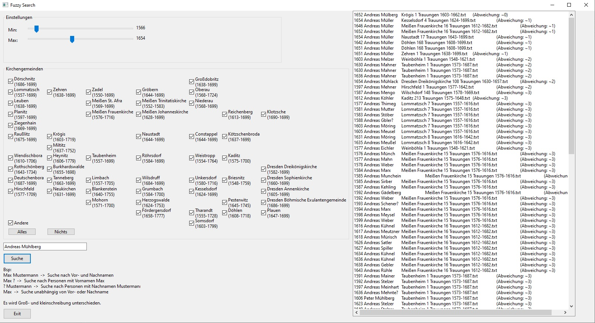

## Fuzzy Search
Ein kleines Tool, um die Trauungen von https://github.com/tintenfrass/simplechurchbookindexes/tree/main/sachsen
einfach durchsuchen zu können. Dabei wird eine Ähnlichkeitssuche verwendet und die Ergebnisse nach Treffergenauigkeit sortiert.

### Installation
Es reicht die Datei indexfuzzysearch_1.0.exe herunterzuladen und zu starten. (Draufklicken und dann erscheint rechts ein Button "Download")
oder Direktlink:
https://github.com/tintenfrass/simplechurchbookindexes/raw/main/sachsen/fuzzy-search/indexfuzzysearch_1.0.exe

Das Programm sollte am besten in einen eigenen Ordner gelegt werden, es legt darin selber noch weitere Dateien an.

Das Programm läuft unter Windows.
Es ist sehr wahrscheinlich, dass beim ersten Start der Windows-Defender bzw. der Virenscanner anschlägt, da muss man sagen, dass das Programm erlaubt werden soll.

Das Programm benötigt eine Internetverbindung.
Beim ersten Start erstellt das Programm einen Ordner "sachsen" und es werden die txt-Dateien mit den Daten aus dem Internet heruntergeladen und dort abgelegt, das kann einige Sekunden dauern.
Wenn die Daten dann aber einmal daliegen, startet das Programm sehr schnell.

Sind neue Daten oder Updates verfügbar, so werden diese automatisch runtergeladen/aktualisiert.

### Benutzung
Das Programm ist eigentlich selbsterklärend, Suchoptionen einstellen und Name des gesuchten Bräutigams eingeben.
Danach erscheint rechts eine große Liste mit Ergebnissen, wobei die besten Treffer oben stehen und nach unten immer schlechter werden.

Wenn man was gefunden hat, dann benötigt man Archion oder Zugang zum Landeskirchlichen Archiv, um sich die vollen Einträge anzusehen.
Bei Kirchenbüchern die nicht sauber chronologisch geführt wurden, ist es oft hilfreich nochmal in die zugehörige txt-Datei zu schauen (die im Ordner "sachsen" liegt) um die genaue Position des Eintrags im Kirchenbuch zu finden.

### Daten
Die Suchergebnisse sind nur so gut, wie die zugrunde liegenden Daten. Das sind Trauungen im Gebeiet Dresden-Meissen bis zum Jahr 1700, teilweise auch noch etwas weiter.
Die meisten Namen sind normalisiert und entsprechen nicht immer genau der Schreibweise im Buch.
Dazu kommen Fehler und Ungenauigkeiten, gerade dann wenn das Kirchenbuch nur schwer lesbar ist, dann ist an vielen Stellen ein '?' eingefügt.
Da die Suche über Ähnlichkeit funktioniert, sollte sie in den meisten Fällen trotzdem die richtigen Einträge finden.

### Screenshot
